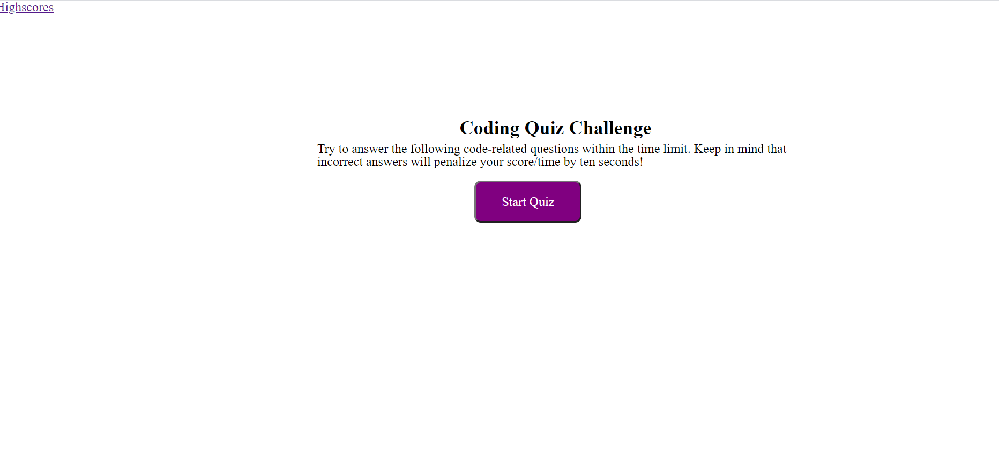
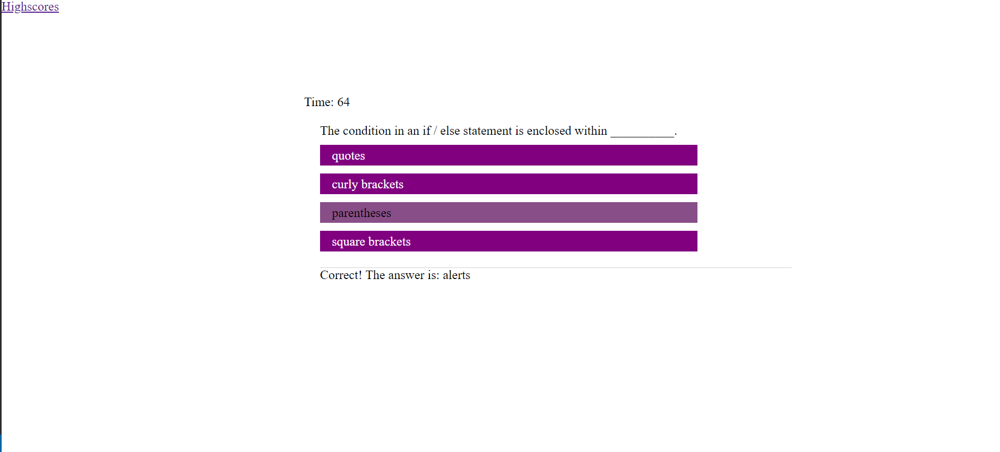
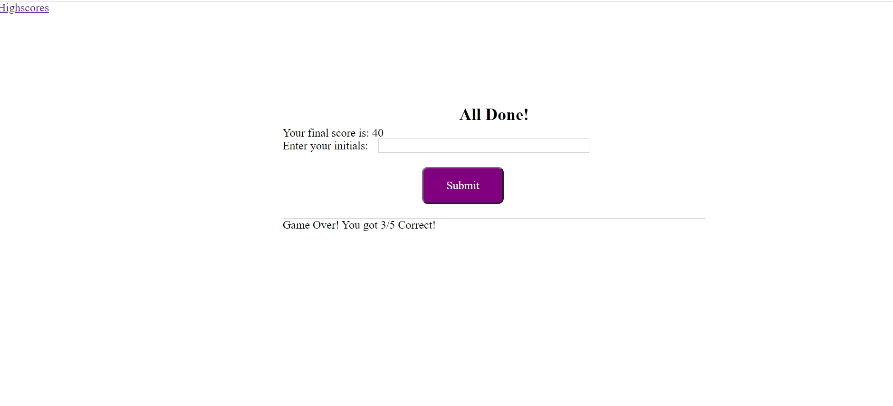
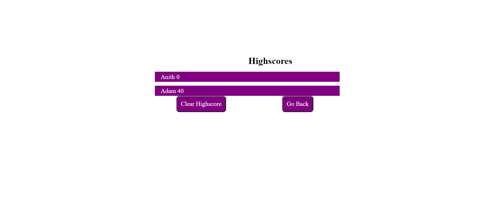

# Homework Day 4
## Code-Quiz
This app is a timed coding quiz with multiple choice questions. 

## Demo of Web page
```
A user clicks through an interactive coding quiz, then enters initials to save the high score before resetting and starting over
```

The following images shows the web application's appearance and functionality:






## Technology used
HTML,CSS,JavaScript


### Links 
* [*GitHub repository*](https://github.com/daliyaebenny/Code-quiz.git)   
* [*GitHub pages*]()
